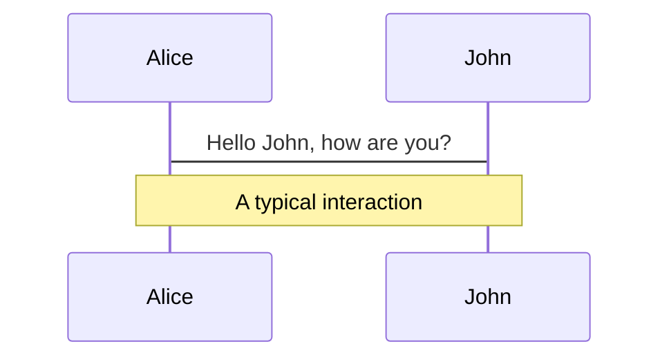
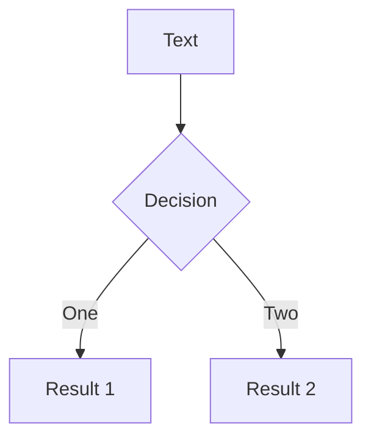
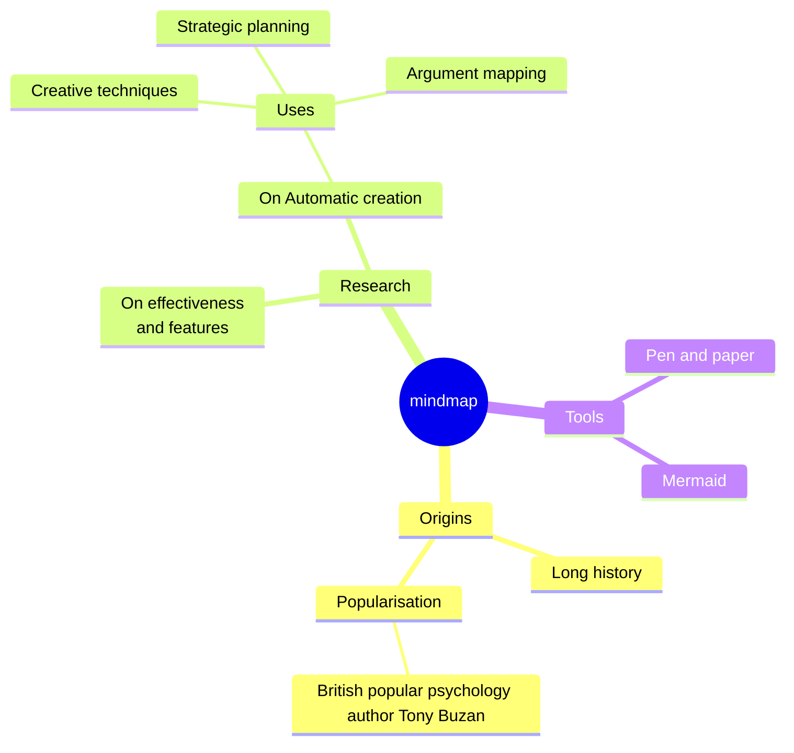
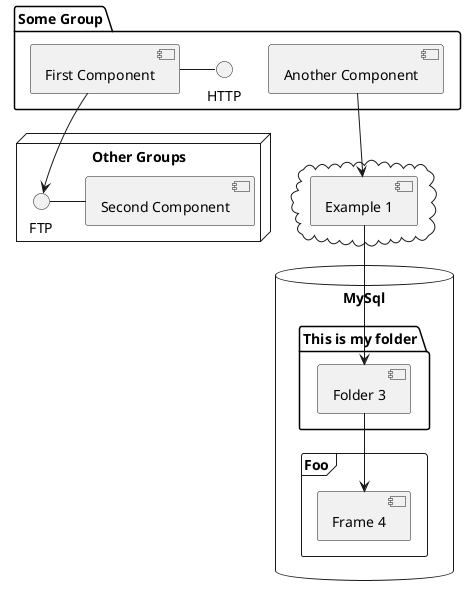

# Storybook

Workshop

<div class="abs-br m-6 text-xl">
  <a href="https://github.com/alexandermikuta/storybook-workshop" target="_blank" class="slidev-icon-btn">
    <carbon:logo-github />
  </a>
</div>

<!--
The last comment block of each slide will be treated as slide notes. It will be visible and editable in Presenter Mode along with the slide. [Read more in the docs](https://sli.dev/guide/syntax.html#notes)
-->

---
layout: image-right
image: /general/storybook2.jpg
---

# Agenda

<Toc text-sm minDepth="1" maxDepth="2" />

---
layout: two-cols-header
transition: fade-out
---

# What is Storybook?

Storybook is a [frontend workshop](https://bradfrost.com/blog/post/a-frontend-workshop-environment/) for building UI components and pages in isolation

::left::

<ul>
  <li data-id="anchor1">Development</li>
  <li v-click="1" data-id="anchor2">Testing</li>
  <li v-click="3" data-id="anchor3">Documentation</li>
</ul>

::right::

<div class="wrapper">
  
  
  
  
</div>

<FancyArrow color="orange" roughness="2" bowing="0.5" arc="0.1" pos2="top"
    q1="[data-id=anchor1]"
    q2="[data-id=anchor4]"
/>
<FancyArrow v-click="1" color="lime" roughness="2" bowing="0.5" arc="0.1"  pos2="left"
    q1="[data-id=anchor2]"
    q2="[data-id=anchor5]"
>Component Testing</FancyArrow>
<FancyArrow v-click="2" color="lime" roughness="2" bowing="0.5" arc="-0.2" pos2="left"
    q1="[data-id=anchor2]"
    q2="[data-id=anchor6]"
>Visual Testing</FancyArrow>
<FancyArrow v-click="3" color="sky" roughness="2" bowing="0.5" arc="-0.1" pos2="top"
    q1="[data-id=anchor3]"
    q2="[data-id=anchor7]"
/>

<!--
You can have `style` tag in markdown to override the style for the current page.
Learn more: https://sli.dev/features/slide-scope-style
-->

<style>
h1 {
  background-color: #2B90B6;
  background-image: linear-gradient(45deg, #4EC5D4 10%, #146b8c 20%);
  background-size: 100%;
  -webkit-background-clip: text;
  -moz-background-clip: text;
  -webkit-text-fill-color: transparent;
  -moz-text-fill-color: transparent;
}

.wrapper {
  height: 400px;
  display: grid;
  grid-template-columns: repeat(2, 1fr);
  grid-auto-flow: dense;
  gap: 20px;

  img {
    width: 100%;
    height: 100%;
    object-fit: contain;
    border: 1px solid #666;
  }
}
</style>
<!--
Here is another comment.
-->

---
transition: slide-up
level: 2
---

# Why build UIs in Isolation?

## The Problem

<figure>
  
  <figcaption>https://storybook.js.org/docs-assets/8.6/get-started/multiverse.png</figcaption>
</figure>

---
transition: slide-up
layout: two-cols-header
layoutClass: gap-16
level: 2
---

# Why build UIs in Isolation?

## The Solution

::left::


Every piece of UI is a [component](https://www.componentdriven.org/)

> You do not need to spin up the whole app to see how they render. You can render a specific variation in isolation by passing props, mocking data or faking events

::right::

<figure>
  <SlidevVideo autoplay controls>
    <source src="/videos/whats-a-story.mp4" type="video/mp4" />
    <p>
      Your browser does not support videos. You may download it
      <a href="https://storybook.js.org/docs-assets/8.6/get-started/whats-a-story.mp4">here</a>.
    </p>
  </SlidevVideo>
  <figcaption>https://storybook.js.org/docs-assets/8.6/get-started/whats-a-story.mp4</figcaption>
</figure>

---
level: 2
---

# Shiki Magic Move

Powered by [shiki-magic-move](https://shiki-magic-move.netlify.app/), Slidev supports animations across multiple code snippets.

Add multiple code blocks and wrap them with <code>````md magic-move</code> (four backticks) to enable the magic move. For example:

````md magic-move {lines: true}
```ts {*|2|*}
// step 1
const author = reactive({
  name: 'John Doe',
  books: [
    'Vue 2 - Advanced Guide',
    'Vue 3 - Basic Guide',
    'Vue 4 - The Mystery'
  ]
})
```

```ts {*|1-2|3-4|3-4,8}
// step 2
export default {
  data() {
    return {
      author: {
        name: 'John Doe',
        books: [
          'Vue 2 - Advanced Guide',
          'Vue 3 - Basic Guide',
          'Vue 4 - The Mystery'
        ]
      }
    }
  }
}
```

```ts
// step 3
export default {
  data: () => ({
    author: {
      name: 'John Doe',
      books: [
        'Vue 2 - Advanced Guide',
        'Vue 3 - Basic Guide',
        'Vue 4 - The Mystery'
      ]
    }
  })
}
```

Non-code blocks are ignored.

```vue
<!-- step 4 -->
<script setup>
const author = {
  name: 'John Doe',
  books: [
    'Vue 2 - Advanced Guide',
    'Vue 3 - Basic Guide',
    'Vue 4 - The Mystery'
  ]
}
</script>
```
````

---

# Diagrams

You can create diagrams / graphs from textual descriptions, directly in your Markdown.

<div class="grid grid-cols-4 gap-5 pt-4 -mb-6">









</div>

Learn more: [Mermaid Diagrams](https://sli.dev/features/mermaid) and [PlantUML Diagrams](https://sli.dev/features/plantuml)

---
src: ./pages/imported-slides.md
hide: false
---

---

# Monaco Editor

Slidev provides built-in Monaco Editor support.

Add `{monaco}` to the code block to turn it into an editor:

```ts {monaco}
import { ref } from 'vue'
import { emptyArray } from './external'

const arr = ref(emptyArray(10))
```

Use `{monaco-run}` to create an editor that can execute the code directly in the slide:

```ts {monaco-run}
import { version } from 'vue'
import { emptyArray, sayHello } from './external'

sayHello()
console.log(`vue ${version}`)
console.log(emptyArray<number>(10).reduce(fib => [...fib, fib.at(-1)! + fib.at(-2)!], [1, 1]))
```

---
hideInToc: true
---

# Thanks!
<br/>

<div class="flex flex-col items-center">

# Code and Slides...

<QRCode
    :width="300"
    :height="300"
    type="svg"
    data="https://github.com/alexandermikuta/storybook-workshop"
    :margin="10"
    :imageOptions="{ margin: 10 }"
    :dotsOptions="{ type: 'extra-rounded', color: 'black' }"
/>

</div>

---
hideInToc: true
---

# Ressources

- [https://storybook.js.org/](https://storybook.js.org/)
- [https://bradfrost.com/](https://bradfrost.com/)
